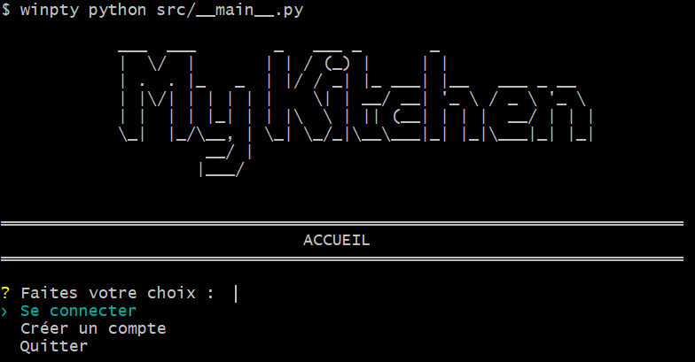

# My Kitchen - Projet informatique 2A

**My Kitchen** est une application de gestion de recettes culinaires développée dans le cadre du projet informatique de 2e année à l'ENSAI. Elle intègre les concepts suivants :  

- Programmation en couches (DAO, service, vue, business_object).  
- Connexion à une base de données PostgreSQL.  
- Interface utilisateur basée sur le terminal via InquirerPy.  
- Appels à un Webservice externe : TheMealDB API.  
- Gestion des favoris et liste de courses.  

---

## :arrow_forward: Fonctionnalités principales

- **Recherche de recettes** : Affichage d'une liste de recettes et détails associés.
- **Suggestion de recettes** : Suggestion de recettes personnalisées basées sur les ingrédients favoris et non désirés 
- **Favoris** : Ajout ou suppression de recettes et ingrédients dans les favoris.  
- **Liste de courses** : Gestion des ingrédients nécessaires pour préparer les recettes sélectionnées.  
- **Administration** : Gestion des recettes via un rôle dédié (Administrateur).  
- **API externe** : Intégration avec TheMealDB pour enrichir les données des recettes.  

---

## :hammer: Pré-requis

- [Python 3.10](https://www.python.org/)  
- [PostgreSQL](https://www.postgresql.org/)  
- [Git](https://git-scm.com/)  
- [Visual Studio Code](https://code.visualstudio.com/)  

---

## :computer: Installation

### Cloner le projet

1. Ouvrez **Git Bash** ou un terminal.  
2. Créez un dossier pour le projet :  
   ```bash
   mkdir -p <chemin_du_dossier> && cd $_
   ```  
3. Clonez ce dépôt :  
   ```bash
   https://github.com/Fathnelle/ENSAI-2A-projet-info-gr12.git
   ```  

### Configurer l'environnement

1. Accédez au répertoire du projet :  
   ```bash
   cd <chemin_du_dossier>
   ```  
2. Installez les dépendances Python :  
   ```bash
   pip install -r requirements.txt
   ```  
3. Configurez les variables d'environnement :  
   - Renommez le fichier `.env.template` en `.env`.  
   - Renseignez vos informations personnelles au lieu des **xxxx**. Exemple :  
     ```env
     WEBSERVICE_HOST="https://www.themealdb.com/api/json/v1/1"

      POSTGRES_HOST=sgbd-eleves.domensai.ecole
      POSTGRES_PORT=5432
      POSTGRES_DATABASE=idxxxx
      POSTGRES_USER=idxxxx
      POSTGRES_PASSWORD=idxxxx
      POSTGRES_SCHEMA=projet
     ```

---

## :rocket: Démarrage

1. **Initialisez la base de données** :  
   - Lancez le script d'initialisation :  
     ```bash
     python src/utils/reset_database.py
     ```  
   - Cela créera les tables nécessaires et importera les données de base.  

2. **Lancez l'application dans Git Bash** :  
   ```bash
   winpty python src/__main__.py
   ```
   

   

---

## :wrench: Tests unitaires

1. Exécutez les tests :  
   ```bash
   python -m pytest -v
   ```  
2. Générez un rapport de couverture :  
   ```bash
   coverage run -m pytest
   coverage html
   ```  
   - Ouvrez le rapport : `htmlcov/index.html`.

---

## :notebook_with_decorative_cover: Architecture

### Structure du projet

```plaintext
src/
├── business_object/                 # Objets métiers et modèles de données
├── client/                          # Récupération des données de l'API
├── dao/                             # Accès aux données et interaction avec la base de données
├── test/                            # Tests du fonctionnement de l'application
├── service/                         # Services exposant des fonctionnalités de l'application
├── utils/                           # Fonctions utilitaires (gestion des logs, fichiers, etc.)
├── view/                            # Interface utilisateur et affichage dans le terminal

```

### Tables principales

- **recettes** : Stocke les informations des recettes.  
- **ingredients** : Liste des ingrédients associés aux recettes.  
- **users** : Gestion des utilisateurs.  
- **favoris** : Association utilisateur-favoris.  
- **liste_de_courses** : Gestion des listes de courses par utilisateur.  

---

## :page_with_curl: Configuration avancée

### Intégration continue

- Workflows GitHub Actions pour :  
  - Lancement automatique des tests unitaires.  
  - Analyse statique du code avec *pylint*.  

---

## :bulb: Contributions

Ce projet est conçu pour être extensible. Vous pouvez :  
- Ajouter de nouvelles fonctionnalités (par exemple, une recherche avancée).  
- Améliorer les performances (optimisation des requêtes SQL).  
- Renforcer la sécurité (gestion des erreurs, validations).  

---  

:wave: **Merci de votre intérêt pour *My Kitchen* !** N'hésitez pas à nous faire part de vos retours ou suggestions.
